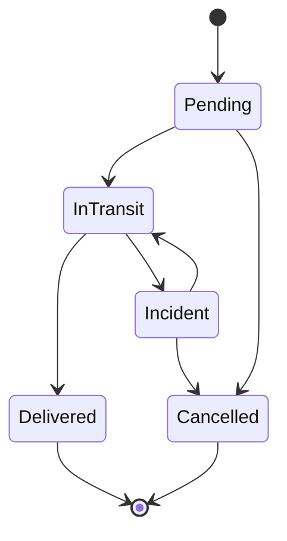

# TMS Demo — API REST de gestión de envíos con .NET 10

Proyecto personal para practicar C# y .NET viniendo de Java / Spring Boot. Es una API REST con la lógica básica de un **TMS (Transport Management System)**: transportistas, envíos, cambios de estado con reglas de negocio y el historial de seguimiento de cada envío (*track & trace*).

## Stack

- **C# / .NET 10** con **ASP.NET Core Web API** (controllers)
- **Entity Framework Core 10** con **SQLite**
- **OpenAPI** + **Scalar** para la documentación interactiva
- **xUnit** para tests unitarios y de integración (`WebApplicationFactory`)
- **GitHub Actions** para compilar y pasar los tests en cada push

## Cómo ejecutarlo

Requisitos: [.NET 10 SDK](https://dotnet.microsoft.com/download) (viene con Visual Studio 2026).

```bash
dotnet run --project src/TmsDemo.Api
```

O desde Visual Studio: abre `TmsDemo.sln` y pulsa F5. Se abre la documentación interactiva en `http://localhost:5109/scalar/v1`.

La base de datos SQLite (`tms.db`) se crea sola al arrancar, con tres transportistas y unos envíos de ejemplo. En `src/TmsDemo.Api/TmsDemo.Api.http` hay peticiones listas para probar desde el propio Visual Studio.

```bash
dotnet test
```

## Endpoints

| Método | Ruta | Qué hace |
|---|---|---|
| `GET` | `/api/carriers` | Lista transportistas |
| `GET` | `/api/carriers/{id}` | Detalle de un transportista |
| `POST` | `/api/carriers` | Alta de transportista |
| `POST` | `/api/carriers/{id}/deactivate` | Desactiva un transportista (no admite envíos nuevos) |
| `POST` | `/api/carriers/{id}/activate` | Lo vuelve a activar |
| `GET` | `/api/shipments?status=&carrierId=&destination=&page=&pageSize=` | Búsqueda con filtros y paginación |
| `GET` | `/api/shipments/{id}` | Detalle con transportista e historial |
| `GET` | `/api/shipments/tracking/{trackingNumber}` | Seguimiento por número de tracking |
| `POST` | `/api/shipments` | Alta de envío (empieza en `Pending`) |
| `PATCH` | `/api/shipments/{id}/status` | Cambio de estado (con nota opcional) |
| `PATCH` | `/api/shipments/{id}/eta` | Reprograma la fecha estimada de entrega (con motivo opcional) |
| `DELETE` | `/api/shipments/{id}` | Borrado (solo si sigue en `Pending`) |

Los errores devuelven `ProblemDetails` (RFC 9457): `400` si la petición no es válida, `404` si no existe el recurso y `422` si se incumple una regla de negocio.

## Reglas de negocio

Ciclo de vida de un envío:



- Cada cambio de estado queda registrado en el historial del envío con fecha y nota.
- Reportar una incidencia (`Incident`) exige una nota explicando qué ha pasado.
- Al pasar a `Delivered` se guarda la fecha de entrega.
- La fecha estimada de entrega se puede reprogramar (siempre a futuro) mientras el envío no esté entregado ni cancelado; el cambio queda en el historial con su motivo.
- No se puede asignar un envío a un transportista inactivo.
- Origen y destino tienen que ser distintos, el peso debe estar entre 0 y 40.000 kg y la fecha estimada de entrega tiene que ser futura.
- Solo se pueden borrar envíos en `Pending`; el resto se cancelan.
- Los números de tracking tienen el formato `TMS` + fecha + 6 caracteres aleatorios (sin `0/O` ni `1/I` para evitar confusiones).

## Estructura

```
src/TmsDemo.Api
├── Domain/          Entidades y reglas de negocio (Shipment, Carrier, ShipmentEvent)
├── Data/            DbContext de EF Core, mapeo de tablas y datos de ejemplo
├── Contracts/       DTOs de entrada y salida (records) y mapeos entidad -> DTO
├── Services/        Casos de uso: consultas, altas y cambios de estado
├── Controllers/     Endpoints REST
└── Infrastructure/  Traducción de excepciones a respuestas HTTP
tests/TmsDemo.Api.Tests
├── Domain/          Tests unitarios de las reglas de negocio
└── Api/             Tests de integración contra la API real con SQLite
```

## Decisiones técnicas

- **Las reglas viven en la entidad.** `Shipment` tiene setters privados y solo cambia de estado a través de `ChangeStatus`, que valida la transición. Así ningún controller o servicio puede dejar un envío en un estado imposible, y las reglas se testean sin base de datos.
- **DTOs separados de las entidades.** La API nunca devuelve entidades de EF Core directamente.
- **Errores centralizados** con `IExceptionHandler` + `ProblemDetails`, sin `try/catch` en los controllers.
- **Fechas siempre en UTC.** SQLite no guarda zona horaria, así que un `ValueConverter` guarda y lee todas las fechas como UTC. La hora actual se inyecta con `TimeProvider` para poder controlarla.
- **`EnsureCreated` en vez de migraciones** para que el proyecto arranque sin pasos extra. En un proyecto real usaría migraciones (`dotnet ef migrations add InitialCreate`).

## Equivalencias con Spring Boot

| Spring Boot | Este proyecto (.NET) |
|---|---|
| `@RestController` + `@GetMapping` | `[ApiController]` + `[HttpGet]` |
| `@Service` + inyección por constructor | `AddScoped<IShipmentService, ShipmentService>()` + constructor primario |
| `@ControllerAdvice` | `IExceptionHandler` |
| JPA / Hibernate + `EntityManager` | EF Core + `DbContext` |
| Spring Data `findBy...` | LINQ sobre `DbSet<T>` |
| Bean Validation (`@NotNull`, `@Size`) | Data Annotations (`[Required]`, `[StringLength]`) |
| `application.yml` | `appsettings.json` |
| springdoc-openapi + Swagger UI | `Microsoft.AspNetCore.OpenApi` + Scalar |
| JUnit + `@SpringBootTest` | xUnit + `WebApplicationFactory` |

## Próximos pasos

- Migraciones de EF Core y PostgreSQL / SQL Server en lugar de SQLite
- Autenticación con JWT y roles (operador, cliente)
- Dockerfile y despliegue
- Integración asíncrona con transportistas mediante una cola de mensajes (RabbitMQ) para recibir actualizaciones de estado
